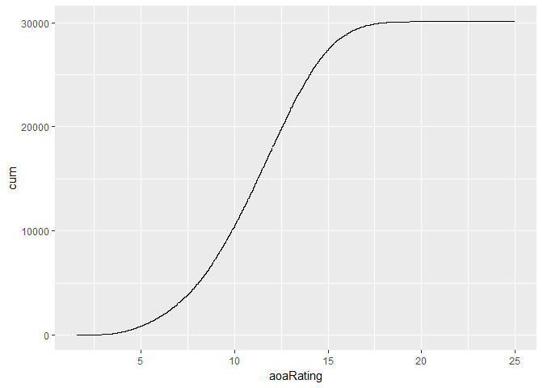

lexvarsdatr
-----------

Description. Just get this clean. Fix as need be per development of workshop.

Data included in package:

| type                        | bib                                                                                                                                                                                                               |
|:----------------------------|:------------------------------------------------------------------------------------------------------------------------------------------------------------------------------------------------------------------|
| CELEX                       | Baayen, R. H., Piepenbrock, R., & Gulikers, L. (1995). The CELEX lexical database \[webcelex\]. *Philadelphia, PA: University of Pennsylvania, Linguistic Data Consortium*.                                       |
| Lexical decision and naming | Balota, D. A., Yap, M. J., Hutchison, K. A., Cortese, M. J., Kessler, B., Loftis, B., ... & Treiman, R. (2007). The English lexicon project. *Behavior research methods*, 39(3), 445-459.                         |
| Concreteness ratings        | Brysbaert, M., Warriner, A. B., & Kuperman, V. (2014). Concreteness ratings for 40 thousand generally known English word lemmas. *Behavior research methods*, 46(3), 904-911.                                     |
| AoA ratings                 | Kuperman, V., Stadthagen-Gonzalez, H., & Brysbaert, M. (2012). Age-of-acquisition ratings for 30,000 English words. *Behavior Research Methods*, 44(4), 978-990.                                                  |
| Word association            | Nelson, D. L., McEvoy, C. L., & Schreiber, T. A. (2004). The University of South Florida free association, rhyme, and word fragment norms. *Behavior Research Methods, Instruments, & Computers*, 36(3), 402-407. |

``` r
library(tidyverse)
## -- Attaching packages --------------------------------------- tidyverse 1.2.1 --
## v ggplot2 2.2.1     v purrr   0.2.4
## v tibble  1.4.1     v dplyr   0.7.4
## v tidyr   0.7.2     v stringr 1.2.0
## v readr   1.1.1     v forcats 0.2.0
## -- Conflicts ------------------------------------------ tidyverse_conflicts() --
## x dplyr::filter() masks stats::filter()
## x dplyr::lag()    masks stats::lag()
#devtools::install_github("jaytimm/lexvarsdatr")
library(lexvarsdatr)
## Data included in this package were obtained from supplemental materials made available from these sources:
##  
## Kuperman, V., Stadthagen-Gonzalez, H., & Brysbaert, M. (2012). Age-of-acquisition ratings for 30,000 English words. Behavior Research Methods, 44(4), 978-990.
## 
## Balota, D. A., Yap, M. J., Hutchison, K. A., Cortese, M. J., Kessler, B., Loftis, B., ... & Treiman, R. (2007). The English lexicon project. Behavior research methods, 39(3), 445-459.
## 
## Brysbaert, M., Warriner, A. B., & Kuperman, V. (2014). Concreteness ratings for 40 thousand generally known English word lemmas. Behavior research methods, 46(3), 904-911.
## 
## Nelson, D. L., McEvoy, C. L., & Schreiber, T. A. (2004). The University of South Florida free association, rhyme, and word fragment norms. Behavior Research Methods, Instruments, & Computers, 36(3), 402-407.
## 
## Baayen, R. H., Piepenbrock, R., & Gulikers, L. (1995). The CELEX lexical database [webcelex]. Philadelphia, PA: University of Pennsylvania, Linguistic Data Consortium.
```

Perhaps we bury this for the time being -- ???

CELEX functions
---------------

``` r
lexvarsdatr::lvdr_get_family(form="think",type="V") %>%
  unlist()%>%
  paste()
##  [1] "bethink_V"       "doublethink_N"   "freethinker_N"  
##  [4] "rethink_N"       "rethink_V"       "think_N"        
##  [7] "think_V"         "thinkable_A"     "thinker_N"      
## [10] "think of_V"      "think out_V"     "think over_V"   
## [13] "think-tank_N"    "think through_V" "think up_V"     
## [16] "unthinkable_A"
```

Behavioral data
---------------

Age-of-acquisition

``` r
lexvarsdatr::lvdr_behav_data %>%
  filter(!is.na(aoaRating)) %>%
  arrange(aoaRating)%>%
  mutate(cum = row_number())%>%
  ggplot(aes(x=aoaRating, y = cum)) +
  geom_line()
```



``` r
lexvarsdatr::lvdr_behav_data %>%
  filter(concRating > 4.5, aoaRating > 15)%>%
  select(Word)%>%
  unlist()%>%
  paste()
##  [1] "podiatrist"      "persimmon"       "oscilloscope"   
##  [4] "daiquiri"        "biophysicist"    "meth"           
##  [7] "dildo"           "chardonnay"      "defibrillator"  
## [10] "methamphetamine" "fluoroscope"     "webcam"         
## [13] "barista"         "hookah"
```
