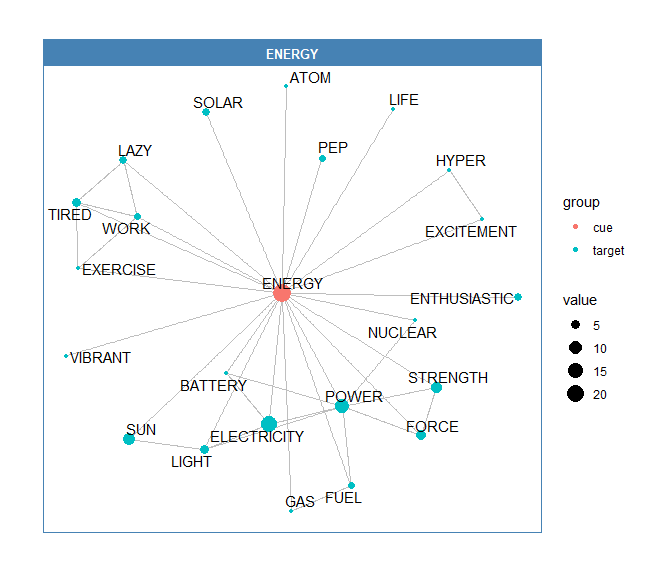

lexvarsdatr
===========

A collection of psycholinguistic/behavioral data, collated from supplemental materials and public databases.

``` r
library(lexvarsdatr) #devtools::install_github("jaytimm/lexvarsdatr")
```

Data included in package:

| Data                           | Source                                                                                                                                                                                                            |
|:-------------------------------|:------------------------------------------------------------------------------------------------------------------------------------------------------------------------------------------------------------------|
| CELEX - English lemma database | Baayen, R. H., Piepenbrock, R., & Gulikers, L. (1995). The CELEX lexical database \[webcelex\]. *Philadelphia, PA: University of Pennsylvania, Linguistic Data Consortium*.                                       |
| Lexical decision and naming    | Balota, D. A., Yap, M. J., Hutchison, K. A., Cortese, M. J., Kessler, B., Loftis, B., ... & Treiman, R. (2007). The English lexicon project. *Behavior research methods*, 39(3), 445-459.                         |
| Concreteness ratings           | Brysbaert, M., Warriner, A. B., & Kuperman, V. (2014). Concreteness ratings for 40 thousand generally known English word lemmas. *Behavior research methods*, 46(3), 904-911.                                     |
| AoA ratings                    | Kuperman, V., Stadthagen-Gonzalez, H., & Brysbaert, M. (2012). Age-of-acquisition ratings for 30,000 English words. *Behavior Research Methods*, 44(4), 978-990.                                                  |
| Word association               | Nelson, D. L., McEvoy, C. L., & Schreiber, T. A. (2004). The University of South Florida free association, rhyme, and word fragment norms. *Behavior Research Methods, Instruments, & Computers*, 36(3), 402-407. |

### lvdr\_behav\_data

For convenience, response times in lexical decision/naming, concreteness ratings, and AoA ratings have been collated into a single data frame, `lex_behav_data`. Approximately 18K word forms are included in all three data sets.

``` r
library(tidyverse)
lexvarsdatr::lvdr_behav_data %>%
  na.omit %>%
  head
##            Word             Pron NMorph   POS lexdecRT lexdecSD  nmgRT
## 7        abacus        "a.b@.k@s      1    NN   964.40   489.00 792.69
## 9       abandon       @.b"an.4@n      1 VB|NN   695.72   220.41 623.96
## 14  abandonment  @.b"an.4@n.m@nt      2    NN   771.09   229.53 794.70
## 26   abbreviate     @.br"i.vi.et      3    VB   795.03   316.55 708.44
## 27  abbreviated @.br"i.vi.%e4.@d      4 JJ|VB   698.45   170.37 695.63
## 28 abbreviation @.br%i.vi."e.Sn=      4    NN   728.91   163.59 714.93
##     nmgSD aoaRating aoaSD concRating concSD freqSUBTLEX
## 7  200.19      8.69  3.77       4.52   1.12          12
## 9   98.25      8.32  2.75       2.54   1.45         413
## 14 256.30     10.27  2.57       2.54   1.29          49
## 26 156.29      9.95  2.07       2.59   1.53           1
## 27 201.23     10.50  1.79       3.10   1.54          16
## 28 149.43      9.11  2.37       3.07   1.51          12
```

### lvdr\_celex

The English lemma portion of the CELEX database can be accessed as `lvdr_celex`. Morphological families can be extracted for both word forms and affixes with the `lvdr_get_family` function.

``` r
lexvarsdatr::lvdr_get_family(form="think",multiword = TRUE)
##  [1] "bethink"       "doublethink"   "freethinker"   "rethink"      
##  [5] "rethink"       "think"         "think"         "thinkable"    
##  [9] "thinker"       "think of"      "think out"     "think over"   
## [13] "think-tank"    "think through" "think up"      "unthinkable"
```

``` r
lexvarsdatr::lvdr_get_family(type="SUF",form="wise")
##  [1] "anticlockwise"    "anticlockwise"    "breadthwise"     
##  [4] "breadthwise"      "broadwise"        "clockwise"       
##  [7] "clockwise"        "coastwise"        "coastwise"       
## [10] "contrariwise"     "counterclockwise" "counterclockwise"
## [13] "crabwise"         "crosswise"        "crosswise"       
## [16] "edgewise"         "endwise"          "leastwise"       
## [19] "lengthwise"       "longwise"         "nowise"          
## [22] "otherwise"        "slantwise"        "slantwise"
```

### lvdr\_association

The South Florida word association data set lives in `lvdr_association`. A description of variables included in the normed data set, as well as methodologies, can be found [here](http://w3.usf.edu/FreeAssociation/).

The `lvdr_get_associates` function enables quick access to word associates for a given cue; associates are listed in descending order (per total subject responses).

``` r
lexvarsdatr::lvdr_get_associates(cue='think')
##  [1] "BRAIN"       "MIND"        "THOUGHT"     "STUDY"       "CONCENTRATE"
##  [6] "IDEA"        "PONDER"      "LEARN"       "HARD"        "KNOW"       
## [11] "KNOWLEDGE"   "SCHOOL"      "SMART"       "COGITATE"    "CONTEMPLATE"
## [16] "DO"          "MEMORY"      "PLAN"        "PROBLEM"     "TALK"       
## [21] "TRY"         "WONDER"
```

The `lvdr_build_network` function builds a network structure for a given search term (or terms).

``` r
network <- lexvarsdatr::lvdr_build_network(search='THINK')
```

Output object contains nodes/edges dataframes, and can be fed directly to any number of network visualization R packages.

``` r
library(tidygraph)
library(ggraph)

routes <- tbl_graph(nodes = network$nodes, edges = network$edges, directed = TRUE) 

ggraph(routes, layout = "graphopt") +
  geom_node_point() +
  geom_edge_link(aes(width = weight), alpha = 0.8) + 
  scale_edge_width(range = c(0.2, 2)) +
  geom_node_text(aes(label = label), repel = TRUE) +
  theme_graph() +
  labs(title = "One-hop associative network for THINK")
```


