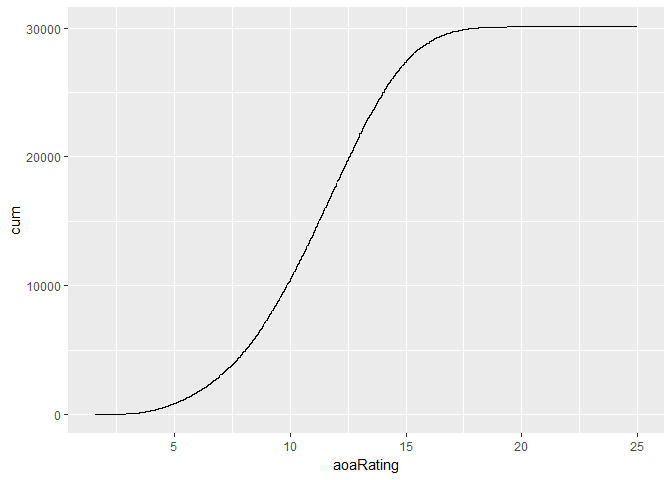

lexvarsdatr:
------------

Data included in package:

Baayen, R. H., Piepenbrock, R., & Gulikers, L. (1995). The CELEX lexical database \[webcelex\]. *Philadelphia, PA: University of Pennsylvania, Linguistic Data Consortium*.

Balota, D. A., Yap, M. J., Hutchison, K. A., Cortese, M. J., Kessler, B., Loftis, B., ... & Treiman, R. (2007). The English lexicon project. *Behavior research methods*, 39(3), 445-459.

Brysbaert, M., Warriner, A. B., & Kuperman, V. (2014). Concreteness ratings for 40 thousand generally known English word lemmas. *Behavior research methods*, 46(3), 904-911.

Kuperman, V., Stadthagen-Gonzalez, H., & Brysbaert, M. (2012). Age-of-acquisition ratings for 30,000 English words. *Behavior Research Methods*, 44(4), 978-990.

Nelson, D. L., McEvoy, C. L., & Schreiber, T. A. (2004). The University of South Florida free association, rhyme, and word fragment norms. *Behavior Research Methods, Instruments, & Computers*, 36(3), 402-407.

``` r
library(tidyverse)
devtools::install_github("jaytimm/lexvarsdatr")
library(lexvarsdatr)
```

``` r
lexvarsdatr::getFamily(form="think",type="V") %>%
  unlist()%>%
  paste()
##  [1] "bethink_V"       "doublethink_N"   "freethinker_N"  
##  [4] "rethink_N"       "rethink_V"       "think_N"        
##  [7] "think_V"         "thinkable_A"     "thinker_N"      
## [10] "think of_V"      "think out_V"     "think over_V"   
## [13] "think-tank_N"    "think through_V" "think up_V"     
## [16] "unthinkable_A"
```

Age-of-acquisition

``` r
lexvarsdatr::lingBehavData %>%
  filter(!is.na(aoaRating)) %>%
  arrange(aoaRating)%>%
  mutate(cum = row_number())%>%
  ggplot(aes(x=aoaRating, y = cum)) +
  geom_line()
```


