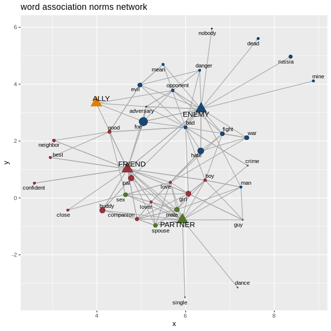

lexvarsdatr
===========

An R package: some tools for investigating lexical variation from both
behavioral and distributional perspectives. Including:

1.  A collection of psycholinguistic/behavioral data sets, &

2.  A few functions for extracting semantic associations and network
    structures from term-feature matrices.

Installation
------------

``` r
library(devtools)
devtools::install_github("jaytimm/lexvarsdatr")
library(lexvarsdatr) 
```

Usage
-----

### Behavioral data

Behavioral data included in the package: Response times in lexical
decision & naming, concreteness ratings, age-of-acquisition (AoA)
ratings, and word association norms. Sources are presented below:

| Data                        | Source                                                                                                                                                                                                            |
|:----------------------------|:------------------------------------------------------------------------------------------------------------------------------------------------------------------------------------------------------------------|
| Lexical decision and naming | Balota, D. A., Yap, M. J., Hutchison, K. A., Cortese, M. J., Kessler, B., Loftis, B., … & Treiman, R. (2007). The English lexicon project. *Behavior research methods*, 39(3), 445-459.                           |
| Concreteness ratings        | Brysbaert, M., Warriner, A. B., & Kuperman, V. (2014). Concreteness ratings for 40 thousand generally known English word lemmas. *Behavior research methods*, 46(3), 904-911.                                     |
| AoA ratings                 | Kuperman, V., Stadthagen-Gonzalez, H., & Brysbaert, M. (2012). Age-of-acquisition ratings for 30,000 English words. *Behavior Research Methods*, 44(4), 978-990.                                                  |
| Word association            | Nelson, D. L., McEvoy, C. L., & Schreiber, T. A. (2004). The University of South Florida free association, rhyme, and word fragment norms. *Behavior Research Methods, Instruments, & Computers*, 36(3), 402-407. |

Response times in lexical decision/naming, concreteness ratings, and AoA
ratings have been collated into a single data frame, `lex_behav_data`.
Approximately 18K word forms are included in all three data sets.

``` r
library(tidyverse)
lexvarsdatr::lvdr_behav_data %>% na.omit %>% head()
```

    ##            Word             Pron NMorph   POS lexdecRT lexdecSD  nmgRT
    ## 7        abacus        "a.b@.k@s      1    NN   964.40   489.00 792.69
    ## 9       abandon       @.b"an.4@n      1 VB|NN   695.72   220.41 623.96
    ## 14  abandonment  @.b"an.4@n.m@nt      2    NN   771.09   229.53 794.70
    ## 26   abbreviate     @.br"i.vi.et      3    VB   795.03   316.55 708.44
    ## 27  abbreviated @.br"i.vi.%e4.@d      4 JJ|VB   698.45   170.37 695.63
    ## 28 abbreviation @.br%i.vi."e.Sn=      4    NN   728.91   163.59 714.93
    ##     nmgSD aoaRating aoaSD concRating concSD freqSUBTLEX
    ## 7  200.19      8.69  3.77       4.52   1.12          12
    ## 9   98.25      8.32  2.75       2.54   1.45         413
    ## 14 256.30     10.27  2.57       2.54   1.29          49
    ## 26 156.29      9.95  2.07       2.59   1.53           1
    ## 27 201.23     10.50  1.79       3.10   1.54          16
    ## 28 149.43      9.11  2.37       3.07   1.51          12

The **South Florida word association data** can be accessed via
`lvdr_association`. A description of variables included in the normed
data set, as well as methodologies, can be found
[here](http://w3.usf.edu/FreeAssociation/). Word association data is
also available as as sparse matrix, `lvdr_association_sparse`.

### Functions

To demonstrate the utility of the functions included in the package, we
first create a simple count-based term-feature co-occurrence matrix
using US Presidential State of the Union (SOTU) addresses – made
available in TIF format via the `sotu` package. A fairly small corpus at
\~2 million words.

Here, we work within the `text2vec` framework. Window size of
co-occurrence, 5x5. For simplicity, we tokenize at the word-level.

``` r
library(sotu)
t2v_ents <- text2vec::itoken(sotu::sotu_text, 
                            preprocessor = toupper, 
                            tokenizer = text2vec::word_tokenizer, 
                            ids = 1:236)

vocab <- text2vec::create_vocabulary(t2v_ents, 
                                    stopwords = toupper(tm::stopwords())) 

pruned_vocab <- text2vec::prune_vocabulary(
  vocab, term_count_min = 10, doc_proportion_max = 0.95) %>%
  filter(!grepl('[0-9]', term))

tcm <- text2vec::create_tcm(t2v_ents, 
                           vectorizer = text2vec::vocab_vectorizer(pruned_vocab), 
                           skip_grams_window = 5L,
                           skip_grams_window_context = "symmetric",
                           weight = c(1,1,1,1,1)) #No weight
```

### § Build PPMI Matrix

The `lvdr_calc_ppmi` function transforms a count-based co-occurrence
matrix to a positive-pointwise mutual information matrix, modified from
this [SO
post](https://stackoverflow.com/questions/43354479/how-to-efficiently-calculate-ppmi-on-a-sparse-matrix-in-r).

``` r
tcm_ppmi <- tcm %>% 
  lexvarsdatr::lvdr_calc_ppmi(make_symmetric = TRUE)
```

### § Get collocates, neighbors, etc.

The `lvdr_get_closest` function can be used to extract the `n` highest
scoring features associated with a term (or set of terms) from a
term-feature matrix. Assumes a column-oriented matrix (`dgCMatrix`) as
input. `data.table` dependency. Modified from the
`udpipe::as.cooccurrence()` function.

Per the SOTU PPMI co-occurrence matrix created above, we extract the ten
strongest **collocates** of the term VIOLENCE. Output is a simple data
frame.

``` r
lexvarsdatr::lvdr_get_closest(tfm = tcm_ppmi, 
                              #lexvarsdatr::lvdr_association_sparse, 
                              target = 'VIOLENCE', 
                              n = 10) %>%
  knitr::kable(row.names = FALSE)
```

| term     | feature      |      cooc|
|:---------|:-------------|---------:|
| VIOLENCE | RIOT         |  6.588764|
| VIOLENCE | UNDERLIES    |  6.455232|
| VIOLENCE | UNPLEASANT   |  6.337449|
| VIOLENCE | UNRESTRAINED |  6.337449|
| VIOLENCE | SYMPATHIZE   |  6.232089|
| VIOLENCE | PREACH       |  6.049767|
| VIOLENCE | INTIMIDATION |  5.895617|
| VIOLENCE | SUPPORTERS   |  5.895617|
| VIOLENCE | PROCLAIM     |  5.701460|
| VIOLENCE | MEDIA        |  5.672473|
| VIOLENCE | SUPPRESSING  |  5.644302|

The function can also be used to extract **nearest neighbors** from a
cosine similarity matrix. To demonstrate, we (1) consolidate feature set
to 150 latent dimensions via singular-value decomposition, and then (2)
construct cosine-based, term-term similarity matrix.

``` r
tcm_svd <-  irlba::irlba (tcm_ppmi, nv = 150)

tcm_svd1 <- as.matrix(data.matrix(tcm_svd$u))
dimnames(tcm_svd1) <- list(rownames(tcm_ppmi), 
                           c(1:length(tcm_svd$d)))

# Create cosine similarity matrix
cos_sim <- text2vec::sim2(x = tcm_svd1, 
                          method = 'cosine', 
                          norm = 'l2')
```

Per matrix, we extract the five **nearest neighbors** (ie, \~synonyms)
for the terms TARIFF and SCIENCE.

``` r
#library(data.table)
lexvarsdatr::lvdr_get_closest(tfm = cos_sim, 
                              target = c('TARIFF','SCIENCE'), 
                              n = 5) %>%
  knitr::kable(row.names = FALSE)
```

| term    | feature       |       cooc|
|:--------|:--------------|----------:|
| SCIENCE | RESEARCH      |  0.5653851|
| SCIENCE | TECHNOLOGY    |  0.5614282|
| SCIENCE | SCIENTIFIC    |  0.4302110|
| SCIENCE | SPACE         |  0.4026902|
| SCIENCE | TECHNOLOGICAL |  0.3858134|
| TARIFF  | TAXATION      |  0.4863073|
| TARIFF  | AD            |  0.4095826|
| TARIFF  | PROTECTIVE    |  0.4077671|
| TARIFF  | REVENUE       |  0.3908540|
| TARIFF  | IMPORTATIONS  |  0.3863255|

### § Build network structure

The `lvdr_extract_network` function extracts the network structure for a
term (or set of terms) from a term-feature matrix (again, as
`dgCMatrix`). The function is built on `lvdr_get_closest()`. Output is a
list that includes a `node` data frame and an `edges` data frame,
structured to play nice with the `tidygraph` and `ggraph` plotting
paradigms.

The number of **nodes** (per term) to include in the network is
specified by the `n` parameter, ie, the `n` highest scoring features
associated with a term from a term-feature matrix. Term-nodes and
feature-nodes are distinguished in the output for visualization
purposes. If multiple terms are specified, nodes are filtered to the
strongest (ie, primary) term-feature relationships (to remove potential
duplicates).

**Edges** include the `n`-highest scoring term-feature associations for
specified terms, as well as the `n` most frequent node-node associations
per node (term & feature).

``` r
network <- lexvarsdatr::lvdr_extract_network (tfm = tcm_ppmi, 
                                              target = toupper(c('enemy', 'ally', 
                                                                 'friend', 'partner')),
                                              n = 15)
```

**Quick note**: Algorithms like `GloVe`, `SVD` & `word2vec` abstract
over the term-feature associations that underlie
(distributionally-derived) semantic relationships. Visualizing the
network structure of semantically related terms based in actual
co-occurrence can help shed light on the sources of relatedness in ways
that, eg, latent dimensions cannot.

**The plot below** illustrates the network structure (based on the PPMI
term-feature matrix for the SOTU corpus) for a set of semantically
related terms: ENEMY, ALLY, FRIEND, and PARTNER. Terms are identified as
triangles; features as circles. Color is used to specify primary
term-feature relationships. Circle size specifies the (relative)
strength of association between primary term and feature.

``` r
set.seed(66)
network %>%
  tidygraph::as_tbl_graph() %>%
  ggraph::ggraph() +
  
  ggraph::geom_edge_link(color = 'darkgray') + 
  ggraph::geom_node_point(aes(size = value, 
                              color = term,
                              shape = group)) +
  
  ggraph::geom_node_text(aes(label = toupper(label), 
                             filter = group == 'term'), 
                             repel = TRUE, size = 4) +
  
  ggraph::geom_node_text(aes(label = tolower(label), 
                             filter = group == 'feature'), 
                             repel = TRUE, size = 3) +
  ggthemes::scale_color_stata()+
  ggtitle('sotu co-occurrence network') +
  theme(legend.position = "none")
```


**Another take** using the word association data set,
`lvdr_association_sparse`:

``` r
network2 <- lexvarsdatr::lvdr_extract_network(
  tfm = lexvarsdatr::lvdr_association_sparse,
  target = toupper(c('enemy', 'ally', 
                     'friend', 'partner')), 
  n = 15)

set.seed(11)
network2 %>%
  tidygraph::as_tbl_graph() %>%
  ggraph::ggraph() +
  
  ggraph::geom_edge_link(color = 'darkgray') + #alpha = 0.8
  ggraph::geom_node_point(aes(size = value, 
                              color = term,
                              shape = group)) +
  
  ggraph::geom_node_text(aes(label = toupper(label), 
                             filter = group == 'term'), 
                             repel = TRUE, size = 4) +
  
  ggraph::geom_node_text(aes(label = tolower(label), 
                             filter = group == 'feature'), 
                             repel = TRUE, size = 3) +
  ggthemes::scale_color_stata()+
  ggtitle('word association norms network') +
  theme(legend.position = "none")
```


